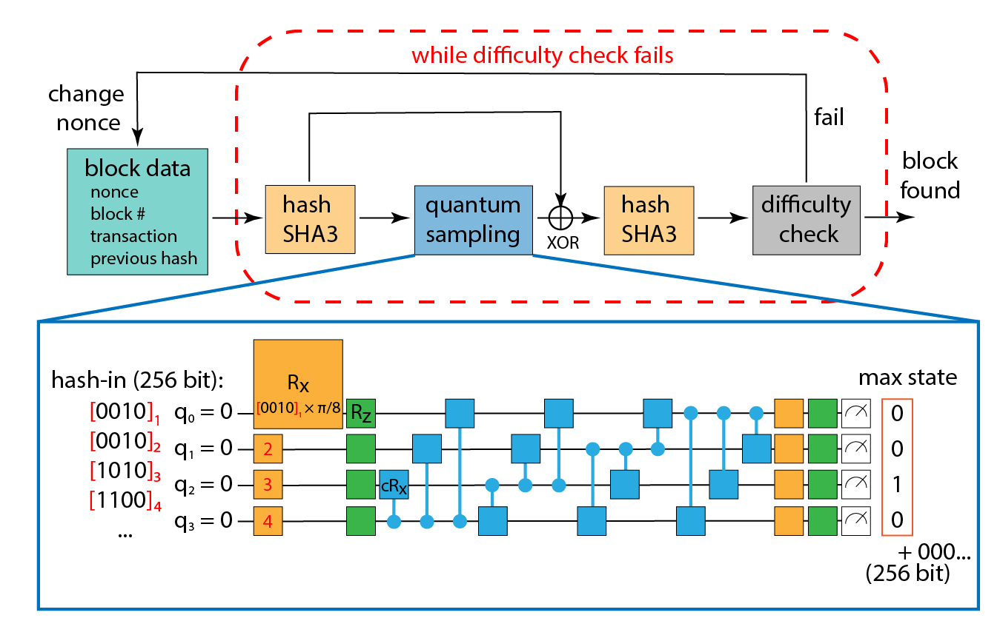

# quantum-Proof-of-Work

## Abstract 
Recently quantum computers have reached the level where they can outperform existing supercomputers in completing specific computationally hard tasks. Despite a handful of demos, available noisy intermediate scale quantum computers (NiSQs) are looking for practical applications. Therefore, we explore the opportunity of applying NISQs in cryptocurrency mining protocols. In our prior work, we proposed, a quantum proof-of-work scheme based on 4-qubits. However, the algorithm based on 4-qubits is far from demonstrating a quantum advantage (a speedup over classical computers). The goal of this study is to push the proof-of-work protocol closer to the quantum advantage regime. To achieve this goal, we devise and test the performance of a new parametric circuit protocol based on 18 qubits with realistic hardware noise.

## Background
The goal of this project is to add a suitable quantum task to the proof-of-work scheme to give quantum computers an advantage. A task too difficult would result in the quantum computer making too many errors, thus rendering it useless. A task too easy would allow classical computers to bypass the quantum task by simulating quantum hardware, which would remove any advantage quantum computers have. The task involves running a parameterized quantum circuit and finding the top output states. The goal is to find a quantum circuit that produces a distribution of output states with peaks; the top output states should be very easy to see on a histogram.

The schematic of our proof-of-work system is shown below.  More detailed explanations can be found in the notebooks.

